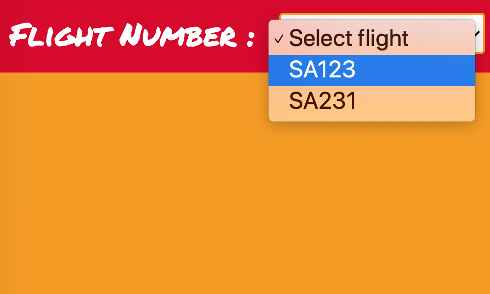

# Welcome to Sligshot Airlines!

__[ Admin passcode: `admin` ]__

---

## Functionality - User & Admin

---

### __USER__ - _Reserve your seat_

Step 1 - Choose your flight | Step 2 - Select your preferred seat
------------ | -------------
 | 

Step 3 - Enter your information and press [ Confirm ] | Step 4 - Your flight is confirmed!
------------ | -------------
 | 

---

### __USER__ - _View your reservation(s)_

| Step 1 - Enter the email address on your reservation and press [ Search ] |
| ------------ |
|  |

| Step 2 - View your reservation(s) |
| ------------ |
|  |

---

### __ADMIN__ - _View all reservations_

| Step 1 - Enter the admin passcode `admin` and press [ View All ] |
| ------------ |
|  |

| Step 2 - View all reservations |
| ------------ |
|  |

---

## Server Endpoints 

---

Method | Endpoint | Description
------------ | ------------- | -------------
GET | `/` | Simple redirect to `/seat-select`
GET | `/flights` | Returns an array with the list of flight numbers.
GET | `/flights/:flightNum` | Returns the seatList array of `:flightNum` with properties `id` and `isAvailable`
GET | `/view-reservation/:id` | Redirects user to `/view-reservation` and displays reservation based on `:id`
GET | `/admin/reservations` | Returns array of all reservation objects.
POST | `/users` | Confirms if seat `isAvailable`. If it is, `isAvailable` becomes false and new reservation is added to the reservations array.
